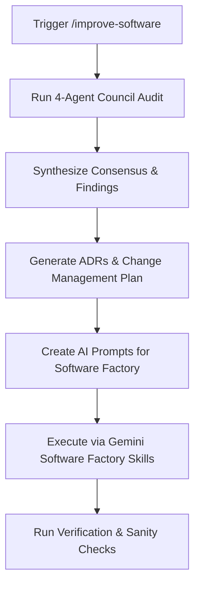

# IMPROVE-SOFTWARE — ChurchCore Council Review & Software Factory Protocol

This protocol defines the repeatable cycle of **auditing code (via the 4-agent Council)**, **planning changes (via ADRs and Change Management)**, and **executing features/fixes (via the Software Factory)** to keep the ChurchCore platform aligned with enterprise-grade MVP, security, and performance standards.

---

## 1. The Improvement Command Cycle

Whenever you need to verify, plan, or improve the ChurchCore software (at the end of a sprint, after major changes, or before a new release), trigger the `/improve-software` workflow:



1. **Audit (Council):** Spawn 4 read-only agents in parallel using the prompts defined below to inspect database state, page routing, UX quality, and feature completeness.
2. **Synthesize:** Group findings into consensus items, list architectural decisions, and outline the sequence of work.
3. **ADRs:** Generate Architectural Decision Records (ADRs) for any new boundaries, role access helpers, integration contracts, or data exposure rules under `docs/adr/`.
4. **Change Management:** Map out the prompts into sequential tasks and track them via repo-local Planning Mode artifacts (`implementation_plan.md`, `task.md`, `walkthrough.md`).
5. **Software Factory Execution:** Hand off the concrete, self-contained AI prompts to the software factory (`gemini-feature-factory`, `gemini-build-with-tests`) to implement the changes to professional standards.

---

## 2. Phase 1: Spawning the Council (Audit Prompts)

Copy these prompts verbatim when spawning the council. Replace `[REPO_ROOT]` with the absolute workspace path.

### Agent 1 — Database & API Audit

```
You are Council Agent 1 for ChurchCore. Your job is a database and API state audit. READ-ONLY — do not edit any files.

Repo root: [REPO_ROOT]

Produce a structured report covering:

1. Migrations — count all CREATE TABLE statements in supabase/migrations/. List each table, whether it has Row Level Security (RLS) enabled, and flag any tables that have no corresponding references in the TypeScript application files.

2. Lib & Server Utilities — list major directories under lib/ (e.g., lib/communications/, lib/supabase/, lib/shepherd-ai/). For each: note key types and check if there are matching repository/service files and unit/integration tests present under tests/ or near the source. Flag gaps.

3. API Routes — list every file under app/api/ (e.g., app/api/ai/route.ts, app/api/demo/feedback/route.ts). Note HTTP method from export names.

4. App Pages — list every page.tsx under app/. Flag any that call redirect() instead of rendering content and any that are empty stubs.

5. Seed data — check supabase/migrations/ or seed files for seed INSERT statements. Is the demo/seed dataset realistic? What is missing?

6. Top 5 critical missing pieces for database/API security and MVP completeness — be specific and honest.

Return concise structured markdown. Target 500–700 words.
```

### Agent 2 — Route & Page Audit

```
You are Council Agent 2 for ChurchCore. Your job is a route and page audit. READ-ONLY — do not edit any files.

Repo root: [REPO_ROOT]

1. Shell nav inventories — read components/application/app-shell.tsx, components/application/member-bottom-nav.tsx, and components/application/reports-shell.tsx. List every nav href.

2. Page existence check — for every href, verify whether a page.tsx exists in app/. Mark each: EXISTS / STUB (calls redirect or <5 lines) / MISSING (404).

3. API route completeness — for every client form or button that does a fetch/POST/PATCH/DELETE, verify the corresponding API route exists under app/api/. Report any orphaned handlers.

4. Link consistency — look for hardcoded hrefs in page files that point to routes not covered by existing pages.

5. Summary table — | Route | Shell | Page Status | Notes |

Return concise structured markdown. Be specific — name every 404 and stub. Target 400–600 words.
```

### Agent 3 — UX & Shell Audit

```
You are Council Agent 3 for ChurchCore. Your job is a UX and shell quality audit. READ-ONLY — do not edit any files.

Repo root: [REPO_ROOT]

1. ARIA correctness — scan shell components and key page files (using Mantine and Lucide components). Check: aria-expanded, aria-selected, aria-label, aria-current. Flag strings used where booleans are needed, or missing where required.

2. Loading and empty states — for each major church-admin, pastor, giving, finance, and member page, does it handle empty data collections gracefully? Is there a loading skeleton or Mantine Loader? Does it crash on empty arrays?

3. CSS/Styling completeness — read next.config.ts, postcss.config.mjs, and look for global CSS styles. Are referenced CSS classes defined? Is there mobile responsiveness?

4. Shell nav active state — how does each layout identify the active nav item? Is it implemented consistently across app-shell and member-bottom-nav?

5. Error handling — are there error.tsx files at app/ level or layout levels? Do server components handle DB errors or let them bubble and crash?

6. Top 3 UX pain points a real user would hit today.

Return concise structured markdown. Be specific. Target 400–600 words.
```

### Agent 4 — Feature & Competitive Audit

```
You are Council Agent 4 for ChurchCore. Your job is feature completeness and competitive gap analysis. READ-ONLY — do not edit any files.

Repo root: [REPO_ROOT]

Read first:
- [REPO_ROOT]/DEVELOPMENT_PLAN.md
- [REPO_ROOT]/docs/security-role-access-matrix.md
- [REPO_ROOT]/docs/tenant-data-segmentation.md

Then audit the actual implementation:

1. Workflow completion — check the progress of the core ChurchCore modules (Member Care, Volunteer Scheduling, Children's Check-in, Events & Registrations, Giving & Finances, Communications, and AI Governance). Give % for each.

2. User role coverage — rate 0–100% role-based access validation for: Super-Admin (Control Plane), Church-Admin, Pastor, Secretary, Ministry-Leader, Teacher, Member.

3. Core operations workflows — rate completeness for: Child Checkin/Checkout Security, Double-entry general ledger, Resend/Twilio dispatch with suppression rules, Impersonation gates, and ADR/HQ Governance logging.

4. Competitive gap — vs. Planning Center Online (PCO), Breeze ChMS, Tithe.ly: the 5 most critical feature/compliance gaps preventing adoption today.

5. MVP readiness score — 0–100 with justification. Be honest.

Return concise structured markdown. Be honest and direct. Target 500–700 words.
```

---

## 3. Phase 2: Synthesis & Change Management

After receiving all 4 agent reports, the synthesis step must produce:

### 1. Cross-Agent Consensus
List findings that multiple agents independently flagged. These are highest priority.

### 2. ADR Drafts
For every architectural decision the council identifies (new boundary, new pattern, new constraint), draft an ADR following the format in `docs/adr/`. Assign the next sequential number.

*ADR triggers:*
- A new module pattern or boundary (e.g., how error.tsx is structured)
- A new role-based access pattern
- A new integration contract
- A new data exposure rule

### 3. Implementation Prompts
For every agreed-upon change, write a concrete implementation prompt using this template:

```
## Prompt [LETTER] — [SHORT TITLE]

**ADR Reference:** ADR-XXXX (if applicable)
**Files:** [comma-separated list of files to create or modify]
**Scope:** [1–3 sentences describing exactly what to build]

**Work:**
1. [Specific step]
2. [Specific step]
...

**Verification:**
- npm test
- npm run lint
- npm run build
- [Any additional checks]
```

### 4. Execution Order
List prompts in dependency order. Note which are independent (can run in parallel) and which must be sequential.

---

## 4. Phase 3: Software Factory Processing (Good Standards)

Every prompt generated by the council review must be executed through the repo-local software factory, adhering to Gemini specific skills (`gemini-feature-factory`, `gemini-build-with-tests`, and `gemini-pr-review` under `.gemini/skills/`).

### Code Quality & Implementation Standards
- **Zero Impurity/Render Violations:** Never call impure functions (e.g., `Date.now()`, `Math.random()`, or async operations) inside React component render loops or `useRef` initializations. Use `useEffect` or React hooks wrappers to isolate side effects.
- **Tenant Database Isolation:** Ensure the control-plane and tenant data surfaces are strictly isolated. All tenant actions must use supabase server/admin connections resolved via church profile sessions.
- **Row Level Security (RLS):** All database changes must enforce RLS check policies utilizing the `current_user_role()` context. Run `npm run audit:rls` to verify schema constraints.
- **Doc Integrity:** Retain existing comments, type boundaries, and docstrings that are unrelated to your changes.
- **No Push to main:** Never commit code directly to `main`. Create a feature branch, run testing suites, and verify via a Pull Request.

### Sanity Checks Before Delivery
Before handing work back to the user, the agent must run:
1. `npm run test` to ensure all Vitest and Playwright test assertions pass cleanly.
2. `npm run lint` to guarantee zero ESLint rules violations.
3. `npm run build` to verify next-compilation builds successfully without compiler exceptions.

---

## Output Location

After each council run, commit the following:

- `docs/reviews/YYYY-MM-DD-council-review-[N]-synthesis.md` — full synthesis with prompts
- `docs/reviews/YYYY-MM-DD-council-review-[N]-agent-[1–4]-*.md` — individual agent reports
- `docs/adr/XXXX-*.md` — any new ADRs drafted by the council
